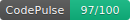

# 🩺 CodePulse CLI

> Advanced static analysis and security scanning for JS/TS projects. Find vulnerabilities, detect hotspots, and visualize code health.

```bash
codepulse scan ./my-project
```

Works **100% locally**. No server. No cloud.

---

## Install

```bash
npm install -g @archpulse/codepulse
```

Or run directly:

```bash
npx @archpulse/codepulse scan .
```

---

## Commands

| Command | Description |
|---------|-------------|
| `codepulse scan [dir]` | Full analysis + HTML report + SARIF |
| `codepulse stats [dir]` | Quick stats in console |
| `codepulse dead [dir]` | Show unused exports |
| `codepulse badge [dir]` | Generate quality badge SVG |
| `codepulse explain [topic]` | Explain detected issues and how to fix them |

---

## What it does

- **🎨 Beautiful Colorful CLI** — Enhanced with rich colors, ASCII art banners, and clear examples for a better developer experience.
- **🤖 Zero-Config MCP Server** — Automatically registers itself as an MCP server for Claude Desktop, Cursor/Cline, Gemini CLI, and Qwen on your first run. AI agents can now seamlessly use CodePulse to audit your codebase!
- **Interactive Visualizations** — explore code structure with Treemaps and Force-Graphs.
- **Quality Badges** — generate a "Health Score" badge for your repository.
- **Security Analysis** — detects `eval()`, hardcoded secrets, and SQL injections.
- **Predictive Analysis (Hotspots)** — combines git churn and complexity to find risk zones.
- **SCA (Dependencies)** — checks `package.json` for vulnerable libraries.
- **Code Duplication** — finds identical code blocks to keep your project DRY.
- **Dependency Graph** — builds a directed graph of all `import`/`require` relations.
- **Dead Code Detection** — finds exports never imported by any other file.
- **Complexity analysis** — cyclomatic complexity per function and file.
- **God file detection** — flags files that are too large or complex.
- **Custom Config** — use `.codepulse.json` to set your own thresholds.
- **Git Ignore support** — respects `.codepulseignore` for clean scanning.

---

## Report output

```
.codepulse-report/
    index.html      ← full dashboard
    graph.svg       ← dependency graph
    badge.svg       ← quality badge
    stats.json      ← raw data
```

### Displaying the Badge

Add this to your `README.md`:
```markdown

```

Open `index.html` in your browser.

---

## Options

```bash
codepulse scan . --open   # Auto-open report in browser
codepulse scan . --sarif  # Generate SARIF report for CI/CD
```

---

## Tech stack

- TypeScript + Node.js
- `@babel/parser` — AST analysis
- `commander` — CLI
- No external services required

---

## License

See [LICENSE](./LICENSE) for details.
