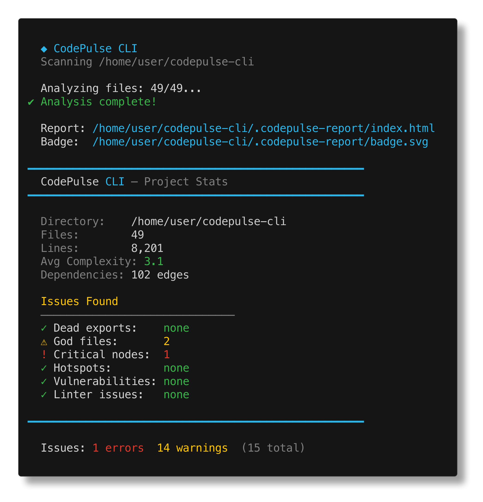
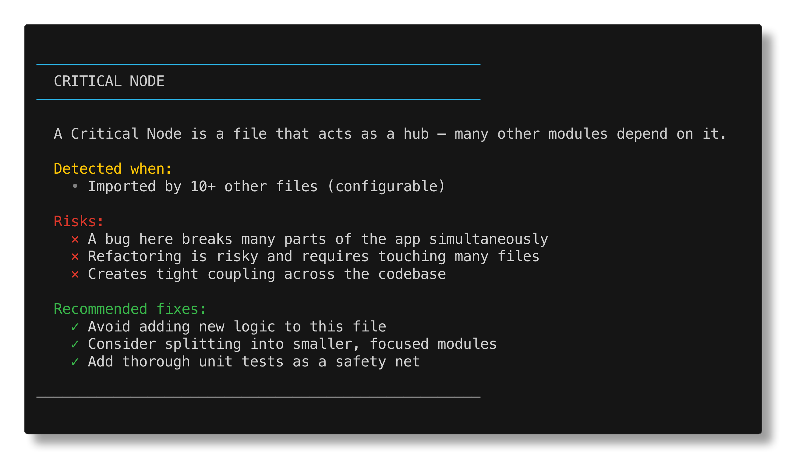
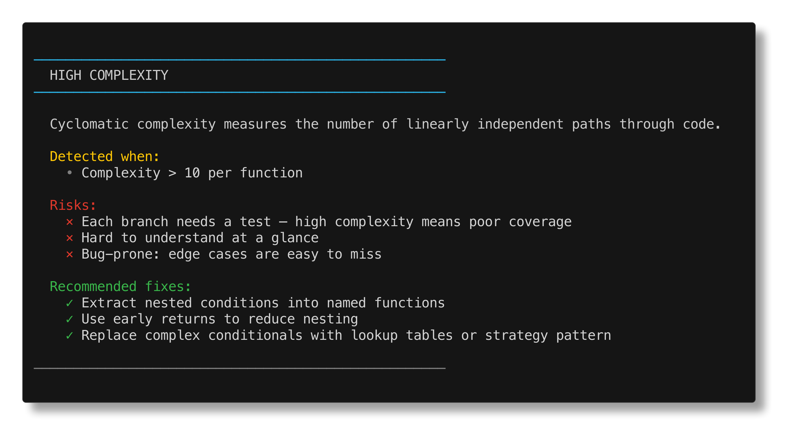
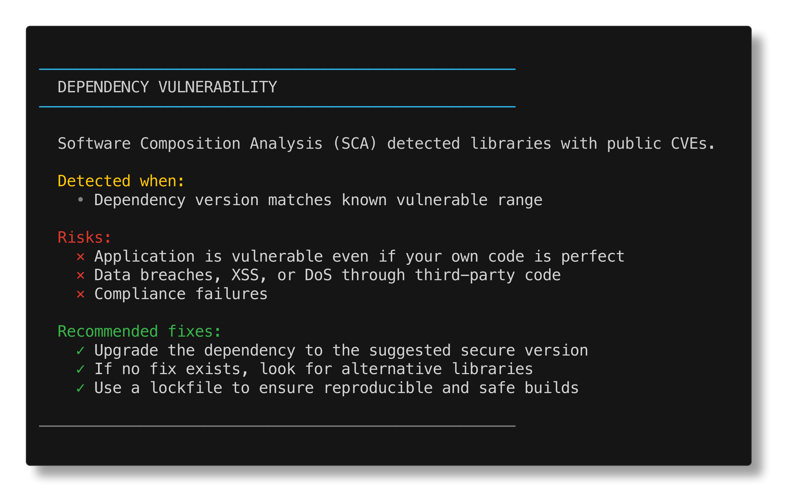
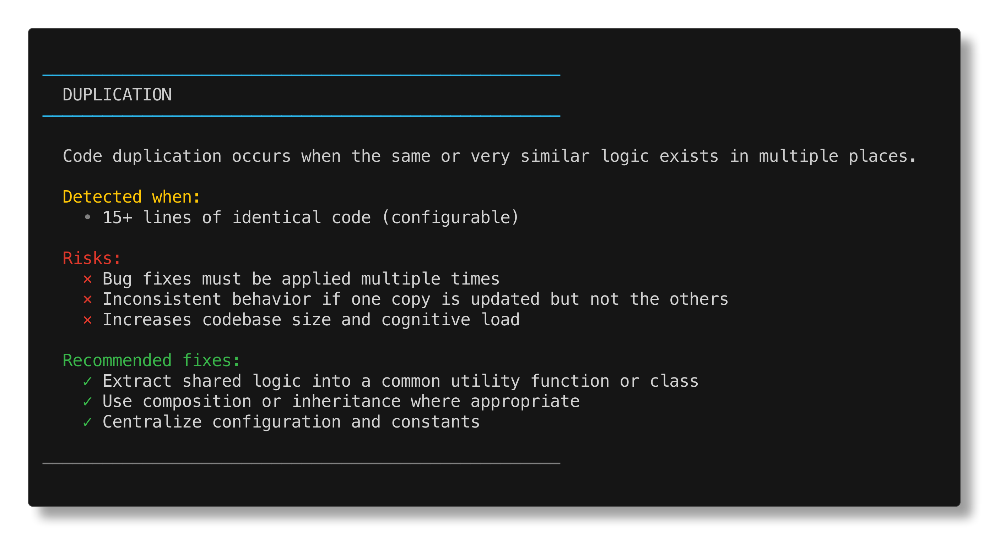

<div align="center">

# 🩺 CodePulse CLI


### 🚀 Analyse de code avancée avec précision chirurgicale

**Intelligence Architecturale • Analyse Sémantique • Surveillance en Temps Réel**

Analyse approfondie de la structure du code pour les grands projets JS/TS et Python


[](https://www.npmjs.com/package/@archpulse/codepulse)
[](https://opensource.org/licenses/MIT)
[](https://nodejs.org/)

---

### 🌍 Langues
[English](../README.md) | [Українська](./README.ua.md) | [Русский](./README.ru.md) | [Čeština](./README.cs.md) | [한국어](./README.ko.md) | [Deutsch](./README.de.md) | [Français](./README.fr.md)

</div>

---

## ⚡ Démarrage rapide

### Installation

```bash
npm install -g @archpulse/codepulse
```

### Première analyse

```bash
# Analysez votre projet
codepulse scan .

# Mode watch avec tableau de bord en direct
codepulse watch .
```

---

## 🏆 Avantage Concurrentiel (Rapport de Mythos)

CodePulse est le seul outil qui unifie l'analyse statique AST, l'analyse Git du churn et du couplage, une Time Machine pour visualiser la dégradation architecturale, la corrélation avec le profiler d'exécution et une intégration native MCP pour les flux de travail des agents IA. Ni SonarQube, ni CodeClimate, ni ESLint n'offrent cette combinaison de « comment c'était, comment c'est maintenant et que faire immédiatement via l'IA ».

## 🎯 Fonctionnalités principales

| Fonctionnalité | Description |
|---------|-------------|
| **🏗️ Radar Architectural** | Définissez les couches et détectez automatiquement les violations de limites |
| **🧠 Duplication Sémantique** | Le hachage basé sur l'AST trouve une logique identique, pas seulement des lignes |
| **⚡ Mode Watch** | Tableau de bord TUI interactif qui se met à jour pendant le codage |
| **🎨 CLI Magnifique** | Couleurs riches, art ASCII, exemples clairs |
| **🌐 7 langues** | Utilisez `--lang` pour basculer entre les langues |
| **📜 Générateur de Licence** | Créez 10+ types de licences open-source instantanément |

---

## 📋 Toutes les commandes

| Commande | Description |
|---------|-------------|
| `codepulse scan [dir]` | Analyse complète + rapport HTML + export SARIF |
| `codepulse watch [dir]` | Tableau de bord TUI interactif en direct |
| `codepulse plugins list` | Liste de tous les plugins disponibles avec métadonnées |
| `codepulse license <type>` | Générer un fichier LICENSE (mit, apache, bsd, gpl, etc.) |
| `codepulse stats [dir]` | Statistiques rapides du projet en console |
| `codepulse explain [topic]` | Explication détaillée des problèmes spécifiques |

---

## 🏗️ Règles d'architecture

Définissez votre structure de projet et vos limites dans `.codepulse.json`:

```json
{
  "architecture": {
    "layers": [
      { 
        "name": "UI", 
        "pattern": "src/ui/.*", 
        "allowDependenciesFrom": ["Services", "Utils"] 
      },
      { 
        "name": "Services", 
        "pattern": "src/services/.*", 
        "allowDependenciesFrom": ["DB", "Utils"] 
      },
      { 
        "name": "DB", 
        "pattern": "src/db/.*", 
        "allowDependenciesFrom": ["Utils"] 
      }
    ],
    "strict": true
  }
}
```

---

## 🔌 Système de plugins

Créez des règles d'analyse personnalisées avec le puissant système de plugins de CodePulse.

### Créer un plugin

Créez un plugin dans le répertoire `~/.config/codepulse/plugins`:

```typescript
import { Rule, AnalysisContext, Issue } from '@archpulse/codepulse';

export default class MyAnalysisPlugin implements Rule {
  name = 'my-custom-plugin';
  description = 'Mon plugin d\'analyse personnalisé';
  version = '1.0.0';
  author = 'Votre nom';
  category = 'code-quality';

  run(context: AnalysisContext): Issue[] {
    // Votre logique d'analyse
    return [];
  }
}
```

### Afficher les plugins chargés

```bash
codepulse plugins list
codepulse plugins list --json
```

📚 **[En savoir plus sur les plugins →](../docs/PLUGINS.md)**

---

## 📚 Documentation

- **📐 [Architecture et flux de travail internes](../docs/ARCHITECTURE.md)** — Comprenez comment CodePulse fonctionne sous le capot
- **🔌 [Développement du système de plugins](../docs/PLUGINS.md)** — Créez vos propres règles d'analyse

---

## 📸 Exemples visuels

<table>
  <tr>
    <td align="center">
      
      <br><strong>Rapport HTML</strong>
    </td>
    <td align="center">
      
      <br><strong>Dépendances critiques</strong>
    </td>
    <td align="center">
      
      <br><strong>Analyse de complexité</strong>
    </td>
  </tr>
  <tr>
    <td align="center">
      
      <br><strong>Détection des God Files</strong>
    </td>
    <td align="center">
      
      <br><strong>Duplication sémantique</strong>
    </td>
    <td align="center">
      
      <br><strong>Problèmes de dépendances</strong>
    </td>
  </tr>
</table>

---

## 🌐 Localisation

```bash
# Français
codepulse --help --lang fr

# Ukrainien
codepulse scan . --lang ua

# Allemand
codepulse watch . --lang de
```

**Langues supportées:** English, Українська, Русский, Čeština, 한국어, Deutsch, Français

---

## 💡 Cas d'usage

### 🏢 Applications d'entreprise
- Imposez les limites architecturales dans les équipes
- Identifiez les nœuds critiques qui impactent plusieurs services
- Surveillez les tendances de complexité du code

### 🎯 Optimisation des performances
- Trouvez et refactorisez les fonctions hautement complexes
- Détectez et éliminez la duplication sémantique du code
- Analysez les chaînes de dépendances pour les goulots d'étranglement

### 🛡️ Qualité du code
- Surveillance continue de l'architecture en mode watch
- Vérification automatique de la conformité des licences
- Règles personnalisées basées sur des plugins pour les standards de votre équipe

---

## 📦 Exigences système

- **Node.js**: 16.0.0 ou supérieur
- **npm**: 6.0.0 ou supérieur (ou yarn/pnpm)
- **OS**: Linux, macOS ou Windows
- **RAM**: 512MB minimum (1GB+ recommandé pour les grands projets)

---

## 🤝 Contribution au projet

```bash
# Clonez le référentiel
git clone https://github.com/archpulse/codepulse-cli.git
cd codepulse-cli

# Installez les dépendances
npm install

# Exécutez les tests
npm test

# Construisez le projet
npm run build

# Essayez localement
npm run dev -- scan .
```

---

## 📄 Licence

Licence MIT © 2024 archpulse

Voir [LICENSE](../LICENSE) pour les détails.

---

<div align="center">

### ⭐ Aimez CodePulse? Donnez-nous une étoile sur GitHub!

**Créé avec ❤️ par archpulse**

</div>
