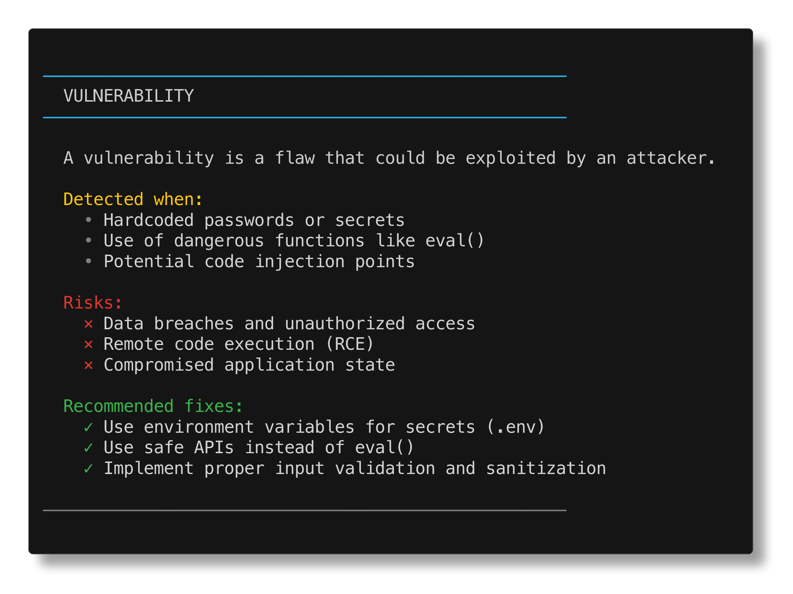

# 🩺 CodePulse CLI (Français)

> Analyse statique avancée et analyse de sécurité pour les projets JS/TS. Détectez les vulnérabilités, identifiez les zones critiques et visualisez la santé du code.

[](https://github.com/archpulse/codepulse-cli)
[](https://www.npmjs.com/package/@archpulse/codepulse)
[](https://opensource.org/licenses/MIT)

---

### 🌍 Langues
[English](../README.md) | [Українська](./README.ua.md) | [Русский](./README.ru.md) | [Čeština](./README.cs.md) | [한국어](./README.ko.md) | [Deutsch](./README.de.md) | [Français](./README.fr.md)

---

## Installation

```bash
npm install -g @archpulse/codepulse
```

## Démarrage rapide

```bash
codepulse scan .
```

---

## Fonctionnalités

- **🎨 CLI Magnifiquement Coloré** — Amélioré avec de l'art ASCII, des bannières et des exemples clairs.
- **🌐 Support Multilingue** — Utilisez `--lang` pour basculer entre 7 langues.
- **📜 Générateur de Licence** — Générez instantanément plus de 10 types de licences open-source.
- **🔌 Système de Plugins** — Étendez CodePulse avec des règles d'analyse personnalisées. [En savoir plus](../docs/PLUGINS.md).
- **🔍 Analyse de Sécurité** — Détecte les vulnérabilités, les secrets codés en dur et les problèmes SCA.
- **🔥 Détection des Hotspots** — Trouve les fichiers à risque basés sur la complexité et l'activité Git.

---

## Screenshots

### Captures d'écran d'explication du programme




---

## Commandes

| Commande | Description |
|---------|-------------|
| `codepulse scan [dir]` | Analyse complète + rapport HTML + SARIF |
| `codepulse plugins [dir]` | Liste de tous les plugins disponibles avec métadonnées |
| `codepulse license <type> [name]` | Générer un fichier LICENSE (mit, apache, bsd...) |
| `codepulse stats [dir]` | Statistiques rapides en console |
| `codepulse explain [topic]` | Explication détaillée des problèmes |

---

## Localisation

Changer la langue du CLI à la volée :
```bash
codepulse --help --lang fr
codepulse scan . --lang fr
```
